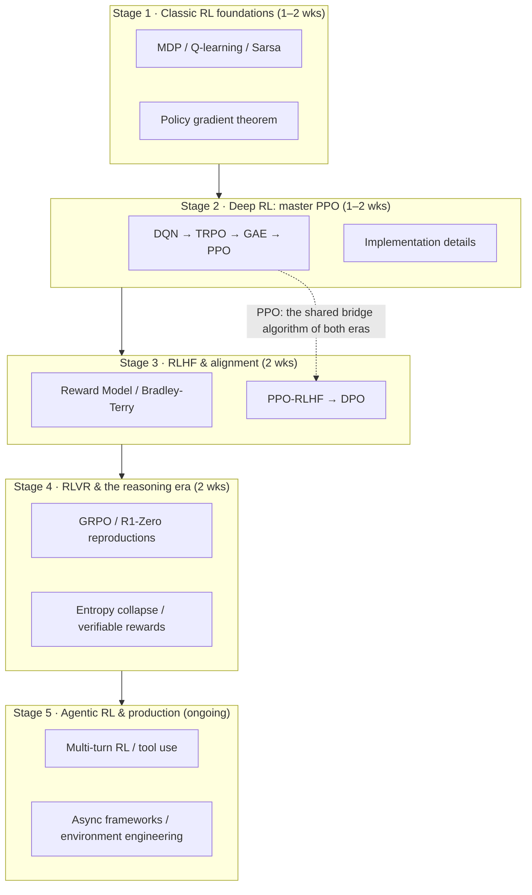

# 🗺️ Awesome RL Roadmap

**From PPO to GRPO: the engineer's path to RL for LLMs**

Classic RL textbooks stop at Atari. RLHF paper lists assume you already
mastered PPO. This roadmap bridges the gap: **every stop tells you what to
read, what code to run, and how many GPUs you need.**

English · [简体中文](README.zh-CN.md)

---

## Why this roadmap

RL learning material is split in two halves that barely touch:

- **Classic RL tutorials** (the Mushook, Sutton & Barto, university courses) stop at Atari and MuJoCo — zero coverage of RLHF / RLVR / agentic RL.
- **LLM-era paper lists** (awesome-RLHF, Awesome-RL-for-LRMs, …) assume you already know PPO, and don't answer the questions engineers actually have: **in what order to learn, which paper per algorithm, which repo to run, how many GPUs.**

This repo is the bridge. It strings both eras into one executable path, curated with a single criterion — *usefulness to a practicing engineer* — so every entry states **where it sits in your journey**.

> v0.1 · 80+ curated entries, kept current by the daily [arXiv digest](digest/README.md).

## Roadmap at a glance

## How to use it

| Pace | For whom | Plan |
|------|----------|------|
| 🏃 4-week sprint | DL background, need post-training NOW | Read only ch. 1–5 of the Mushook in Stage 1; skip Atari in Stage 2, go straight to CleanRL's PPO; one week each for Stages 3–4 |
| 🚶 8-week steady | Transitioning engineers / grad students | Default pacing through Stage 4; pass every "exit check" before moving on |
| 🔍 Weekend sampler | Deciding whether this direction is worth it | Stage 0 + one Q-learning notebook from Stage 1 + nano-aha-moment from Stage 4 (if you have a GPU) |

## The hardware ladder (know your rung first)

| Budget | What you can do |
|--------|-----------------|
| No GPU / Colab | All of Stages 1–2 (tabular methods, CartPole-scale deep RL) |
| 1× consumer 24GB (4090-class) | 7B QLoRA SFT/DPO with TRL; full Stage 3 practice |
| 1× 80GB (A100/H100) | nano-aha-moment 3B full-parameter R1-Zero; single-card small-model GRPO with verl |
| 4× 80GB | 7B full-parameter RLHF (OpenRLHF / verl); TinyZero-scale reproductions |
| 8× H100/H200 | The nanoRLHF full stack; async RL (AReaL); production throughput |

---

## Stage 0 · First decide: do you actually need RL?

**Goal:** avoid the most expensive mistake — building an RL pipeline for a task that doesn't need one.

- [SFT Memorizes, RL Generalizes: A Comparative Study of Foundation Model Post-training](https://arxiv.org/abs/2501.17161) (2025) — when SFT is enough (format following, knowledge injection) and when RL wins (generalization, exploration).
- Rule of thumb: if your task has a **cheap verifiable correctness signal** (math answers, unit tests, tool-call success), RL pays off most. If only human preference is available, go to RLHF (Stage 3). If you don't even have preference data, go back to SFT.

---

## Stage 1 · Classic RL foundations (1–2 weeks)

**Goal:** build intuition for the three pillars — MDPs, value functions, policy gradients.
**Exit check:** you can explain the on/off-policy difference between Q-learning and Sarsa; sketch the policy gradient theorem; articulate why exploration/exploitation is the fundamental tension.

**📚 Read**

- [Mushook / easy-rl](https://github.com/datawhalechina/easy-rl) (⭐14.7k, Chinese) — the best Chinese-language entry point. Chapters 1–6 cover this entire stage; based on Hung-yi Lee's course, with PDFs and Bilibili videos.
- [Sutton & Barto, *Reinforcement Learning: An Introduction*](http://incompleteideas.net/book/the-book-2nd.html) (free official PDF) — read ch. 3–6 closely (MDP/DP/TD), ch. 13 (policy gradient) selectively. The bible — but don't read it cover to cover first.
- [David Silver's UCL course](https://www.davidsilver.uk/teaching/) — the classic video course; lectures 1–7 map to this stage.
- [Berkeley CS285 (Sergey Levine)](https://rail.eecs.berkeley.edu/deeprlcourse/) — the deeper, systematic option.

**⚡ Run**

- [norhum/reinforcement-learning-from-scratch](https://github.com/norhum/reinforcement-learning-from-scratch) — five notebooks from bandits (ε-greedy/UCB) to A2C; a weekend's worth.
- [Mushook notebooks](https://github.com/datawhalechina/easy-rl/tree/master/notebooks) — Chinese-commented implementations of Value Iteration / Q-learning / Sarsa / Policy Gradient.
- [Gymnasium](https://gymnasium.farama.org/) — the standard RL environment library; CartPole is your "Hello World".

---

## Stage 2 · Deep RL: master PPO (1–2 weeks)

**Goal:** PPO is the bridge to RLHF — king of the Atari era and workhorse of RLHF alike. This stage has a single objective: know PPO cold, from objective function to implementation details.
**Exit check:** explain why the clipped surrogate beats trust regions in practice; how GAE's λ trades bias for variance; know advantage normalization, entropy bonuses, and friends.

**📚 Read**

- [Playing Atari with Deep RL (DQN)](https://arxiv.org/abs/1312.5602) (2015, Nature) — the start of deep RL: experience replay + target networks.
- [TRPO](https://arxiv.org/abs/1502.05477) (2015) — the trust-region idea; read for intuition, skip the derivations.
- [GAE](https://arxiv.org/abs/1506.02438) (2015) — exponentially-weighted advantage estimation; the standard companion of PPO.
- [PPO](https://arxiv.org/abs/1707.06347) (2017) — **required close reading**. Short, extremely dense.
- [OpenAI Spinning Up](https://spinningup.openai.com/) — the friendliest deep-RL intro with a PPO walkthrough; harvest its "Key Papers" list.
- [The 37 Implementation Details of PPO](https://iclr-blog-track.github.io/2022/03/25/ppo-implementation-details/) (ICLR Blog Track 2022) — the details papers omit but outcomes depend on. A cornerstone for engineers.

**⚡ Run**

- [CleanRL](https://github.com/vwxyzjn/cleanrl) (⭐4k+) — single-file style; `ppo_continuous_action.py` is the close-reading target: check it line by line against the 37 details.
- [NeatRL](https://github.com/YuvrajSingh-mist/NeatRL) — DQN family / TD3 / SAC / PPO / PPO-RND, one self-contained file each, with W&B; good for horizontal comparison.
- Environments: CartPole (debugging) → MuJoCo (continuous control) → Atari (optional rite of passage).

---

## Stage 3 · RLHF & alignment (2 weeks)

**Goal:** understand the full chain from human preference to policy update — preference data → reward model → constrained policy optimization — and the trade-offs between the PPO and DPO family lines.
**Exit check:** write down the Bradley-Terry preference loss; explain what the KL penalty and reference model guard against (reward hacking); articulate what DPO buys (no explicit RM, no RL loop) and what it costs.

**📚 Read**

- [Deep RL from Human Preferences](https://arxiv.org/abs/1706.03741) (2017) — the origin of RLHF: preference learning + reward models in their original form.
- [InstructGPT](https://arxiv.org/abs/2203.02155) (2022) — the complete template of LLM-era RLHF: SFT → RM → PPO. Required close reading.
- [Constitutional AI](https://arxiv.org/abs/2212.08073) (Anthropic, 2022) — the RLAIF line: AI feedback instead of human annotation.
- [DPO](https://arxiv.org/abs/2305.18290) (2023) — the closed-form solution that bypasses the reward model and RL loop; among the most deployed alignment algorithms. Work through the derivation by hand.
- [Self-Rewarding LLMs](https://arxiv.org/abs/2401.10020) (2024) — models judging their own preferences, iterating on themselves.
- [RLHF Book (Nathan Lambert)](https://rlhfbook.com/) — free online; the most systematic engineering text on RLHF. The backbone of this stage.
- [HuggingFace Blog: Illustrating RLHF](https://huggingface.co/blog/rlhf) — three diagrams, full pipeline; the first thing to read.

**⚡ Run**

- [TRL](https://github.com/huggingface/trl) — official HF library; `DPOTrainer` + QLoRA runs DPO on a 7B model with a single 24GB consumer card. **The main battlefield on a tight budget.**
- [hyunwoongko/nanoRLHF](https://github.com/hyunwoongko/nanoRLHF) — everything hand-written except PyTorch/Triton: dataset lib, distributed engine, 3D parallelism, inference engine, SFT + async PPO (Qwen3-0.6B, MATH-500 43.4 → 46.6). Reading it = understanding the modern post-training stack. Developed on 8×H200, but open to everyone as reading material.
- [alignment-handbook](https://github.com/huggingface/alignment-handbook) — HF's reproducible alignment recipes from SFT through DPO.

---

## Stage 4 · RLVR & the reasoning era (2 weeks)

**Goal:** understand the R1 paradigm — RL directly on a base model with **verifiable rewards** (math correctness / code tests) instead of human preferences, eliciting reasoning — and master GRPO and its variants.
**Exit check:** explain what GRPO removes relative to PPO and why that saves memory; explain entropy collapse and standard countermeasures (e.g. DAPO's clip-higher); know the applicability boundary of verifiable rewards.

**📚 Read**

- [Let's Verify Step by Step](https://arxiv.org/abs/2305.20050) (OpenAI, 2023) — the empirical starting point of process rewards (PRM) vs outcome rewards.
- [Scaling LLM Test-Time Compute Optimally](https://arxiv.org/abs/2408.03314) (2024) — test-time compute scaling; what RL actually buys.
- [DeepSeekMath / GRPO](https://arxiv.org/abs/2404.05128) (2024) — where GRPO comes from: group-relative advantages instead of a critic.
- [DeepSeek-R1](https://arxiv.org/abs/2501.12948) (2025) — **the central paper of this stage**: pure-RL R1-Zero training, the aha moment, the distillation route.
- [Kimi k1.5 technical report](https://arxiv.org/abs/2501.12599) (2025) — an alternative engineering line with long-context RL.
- [VinePPO](https://arxiv.org/abs/2410.01679) (2024) — Monte-Carlo value estimates replacing value networks: less variance, fewer resources.
- [DAPO](https://arxiv.org/abs/2503.14476) (ByteDance, 2025) — production-grade GRPO improvements for entropy collapse and dynamic sampling.
- [Understanding R1-Zero-Like Training (Dr. GRPO)](https://arxiv.org/abs/2503.20783) (2025) — identifies and fixes length bias in the GRPO loss.
- [Search-R1](https://arxiv.org/abs/2503.09516) (2025) — RL training an LLM to call a search engine; your stepping stone into Stage 5 (agentic RL).
- [OpenAI o1 blog post](https://openai.com/index/learning-to-reason-with-llms/) — no paper, but the paradigm starts here.
- [A Survey of RL for Large Reasoning Models](https://arxiv.org/abs/2509.08827) (Tsinghua, 2025) — the systematic overview when you want the full map; [companion repo](https://github.com/TsinghuaC3I/Awesome-RL-for-LRMs) keeps updating.

**⚡ Run (upgrade with your budget)**

- [TinyZero](https://github.com/TIGER-AI-Lab/TinyZero) (Berkeley SkyLab) — reproduces the R1-Zero aha moment on a 1.5B model for ~$30 of GPU time. **The highest-value first experiment.**
- [nano-aha-moment](https://github.com/McGill-NLP/nano-aha-moment) (McGill NLP) — single file, single 80GB GPU, 3B full-parameter R1-Zero, zero RL-framework dependencies, with Karpathy-style video lectures. **The most recommended codebase for close reading.**
- [verl](https://github.com/volcengine/verl) (ByteDance) — production-grade RL training framework with ready-to-run GSM8K GRPO recipes; your gateway into the real industrial stack.

---

## Stage 5 · Agentic RL & production (ongoing)

**Goal:** move from single-turn math problems to multi-turn, tool-using, environment-embedded agent RL — and learn how industry fights on throughput and stability.
**Exit check:** articulate the credit-assignment difficulty of multi-turn RL; the synchronous vs asynchronous RL trade-off; design a reward and environment for a concrete task.

**📚 Read**

- [AgentsMeetRL](https://github.com/thinkwee/AgentsMeetRL) (⭐1.9k + [website](https://thinkwee.top/amr/)) — the de-facto standard paper list for agentic RL: multi-agent, tool learning, RLVR; ships a Claude plugin to search itself.
- [TsinghuaC3I/Awesome-RL-for-LRMs](https://github.com/TsinghuaC3I/Awesome-RL-for-LRMs) — survey companion with a taxonomy of reward design / algorithms / evaluation.
- [Search-R1](https://arxiv.org/abs/2503.09516) and its successors (ReTool, the ToolRL line) — representative tool-use RL work; follow the tool-learning section of AgentsMeetRL.

**⚡ Run / framework quick reference**

| Framework | Positioning | For |
|-----------|-------------|-----|
| [verl](https://github.com/volcengine/verl) | Production-grade, largest ecosystem, richest recipes | The default if you want the industrial mainline |
| [OpenRLHF](https://github.com/OpenRLHF/OpenRLHF) | Ray-based, gentle learning curve | Fast starts at small-mid scale |
| [TRL](https://github.com/huggingface/trl) | Seamless HF integration | Consumer GPUs / LoRA settings |
| [AReaL](https://github.com/inclusionAI/AReaL) | Async RL, large scale | Exploring rollout-throughput limits |
| [slime](https://github.com/THUDM/slime) | Powered by the SGLang inference engine | Rollout efficiency |
| [DeepSpeed-Chat](https://github.com/microsoft/DeepSpeedExamples) | Historically important (early RLHF 3-stage template) | Archaeology; not recommended for new projects |

**🧪 Environments & benchmarks:** GSM8K / MATH / AIME (math), Countdown (built into TinyZero and nano-aha-moment), HumanEval (code) — the standard RLVR battlegrounds. For agentic environments, start from verl's recipe zoo and the environments open-sourced with each paper.

---

## Stay current

- **This repo's [arXiv digest](digest/README.md)** — auto-collected RL-for-LLM papers every weekday, keyword-tagged, one cumulative file per week.
- [opendilab/awesome-RLHF](https://github.com/opendilab/awesome-RLHF) (⭐4.4k) — the most complete alignment-paper index.
- [opendilab/awesome-RLVR](https://github.com/opendilab/awesome-RLVR) — the verifiable-rewards direction.
- [AgentsMeetRL](https://github.com/thinkwee/AgentsMeetRL) — the agentic direction.
- [chandar-lab/rl-exploration](https://github.com/chandar-lab/rl-exploration) — reasoning / RL exploration.
- For classics, [aikorea/awesome-rl](https://github.com/aikorea/awesome-rl) (unmaintained but still the best literature map).

## FAQ

**Q: I only build applications (RAG / agent orchestration). Do I need all this?**
Through Stage 3 is enough — understanding how alignment shapes model behavior makes you a better application engineer. Stages 4–5 are for people training or modifying models.

**Q: Will DPO replace PPO?**
Not wholesale. DPO is simple and stable but has known blind spots (offline distribution shift; it can't exploit online rollout signals). In the R1 era, RLVR's workhorse went back to online policy optimization (GRPO is PPO family). Know both lines.

**Q: What if I don't have big GPUs?**
Rung 2 of the hardware ladder (one 24GB card) covers all of Stages 1–3. Enter Stage 4 via TinyZero (~$30 of rented GPU time) and reading nano-aha-moment source; go hands-on when you have an 80GB card.

**Q: How do classic RL (Atari/MuJoCo) and LLM RL actually relate?**
PPO is the shared trunk: value functions, advantage estimation, and clipped objectives are isomorphic across both eras; what changed is the "environment" (games → token sequences) and the "reward" (game score → RM or verifier). That's why this roadmap insists on Stages 1–2 first.

## Contributing

PRs welcome: new entries, link fixes, field notes from your own runs. **Every entry needs a one-line "why it matters"** — bare links are rejected. See [CONTRIBUTING.md](CONTRIBUTING.md).

## Acknowledgments & license

- Entry curation stands on the shoulders of the Mushook, CleanRL, Spinning Up, and the many awesome-list maintainers — thanks to all linked projects' authors.
- Code (`scripts/`) and content are released under [MIT](LICENSE).
