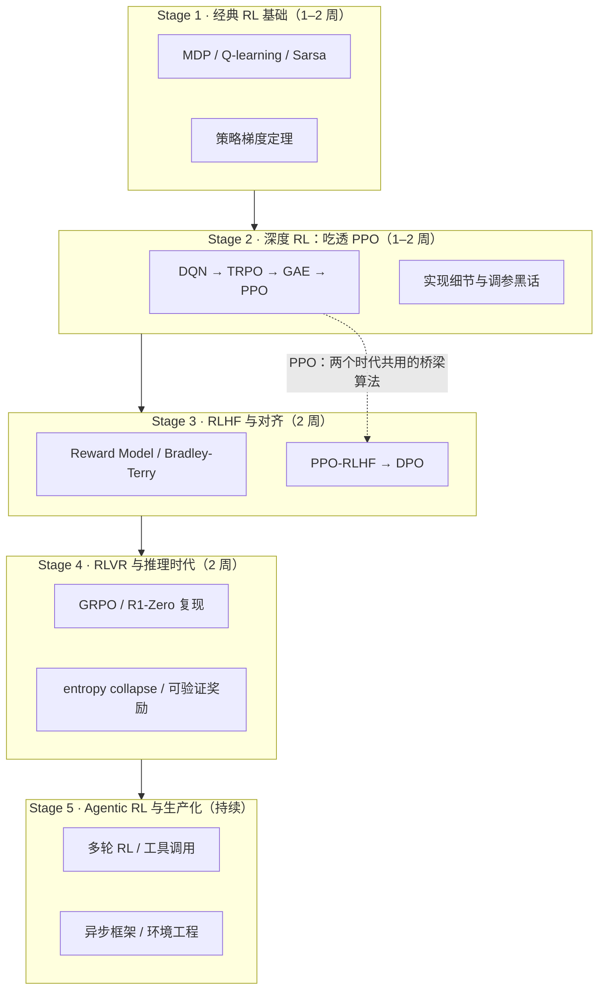

# 🗺️ Awesome RL Roadmap

**从 PPO 到 GRPO：LLM 时代强化学习工程师路线图**

经典 RL 教材不教 RLHF，RLHF 论文清单又默认你已吃透 PPO ——
这份路线图补上中间的断层：**每一站告诉你读什么、跑什么代码、需要多少显卡。**

[English](README.md) · 简体中文

---

## 为什么需要这份路线图

市面上的 RL 资料断裂成了两半：

- **经典 RL 教程**（蘑菇书、Sutton & Barto、各大学课程）止步于 Atari 和 MuJoCo，完全不覆盖 RLHF / RLVR / agentic RL；
- **LLM 时代论文清单**（awesome-RLHF、Awesome-RL-for-LRMs 等）默认读者已懂 PPO，对工程师的真正问题——**按什么顺序学、每个算法读哪篇、跑哪个 repo、要多少卡**——没有答案。

本仓库是一座桥：以"工程师能上手"为唯一标准，把两个时代串成一条可执行的学习路径。它不是又一篇论文堆砌，每个条目都标注了**它在你旅程中的位置**。

> v0.1 · 收录 80+ 条精选资源 + 配套数学推导，每日随 [arXiv 日报](digest/README.md) 持续更新。

## 路线图总览

## 怎么用

| 节奏 | 适合谁 | 方案 |
|-------|--------|------|
| 🏃 4 周冲刺 | 有深度学习基础、急需上手后训练 | Stage 1 只读蘑菇书前 5 章；跳过 Stage 2 的 Atari 部分，直接在 CleanRL 里精读 PPO；Stage 3–4 每周一个 |
| 🚶 8 周稳扎 | 转型工程师 / 研究生 | 按默认节奏走完 Stage 1–4，每站的"出口自检"必须全过 |
| 🔍 周末采样 | 只想判断这个方向值不值得投入 | Stage 0 + Stage 1 的 Q-learning notebook + Stage 4 的 nano-aha-moment（如果有卡） |

## 硬件阶梯（先确认你能跑到哪一级）

| 预算 | 能做什么 |
|------|----------|
| 无 GPU / Colab | Stage 1–2 全部（表格法和 CartPole 级深度 RL） |
| 1× 消费级 24GB（4090 级） | 7B 的 QLoRA SFT/DPO（TRL）；Stage 3 全流程 |
| 1× 80GB（A100/H100） | nano-aha-moment 3B 全参数 R1-Zero 训练；verl 单卡小模型 GRPO |
| 4× 80GB | 7B 全参数 RLHF（OpenRLHF / verl）；TinyZero 级复现 |
| 8× H100/H200 | nanoRLHF 全栈；异步 RL（AReaL）；生产级吞吐 |

---

## Stage 0 · 先想清楚：你真的需要 RL 吗

**目标：** 避免最贵的错误——为不需要 RL 的任务搭 RL 管线。

- [SFT Memorizes, RL Generalizes: A Comparative Study of Foundation Model Post-training](https://arxiv.org/abs/2501.17161)（2025）— 什么时候 SFT 就够（格式遵循、知识注入），什么时候必须 RL（泛化与探索）。
- 经验法则：如果你的任务有**廉价可验证的正确性信号**（数学答案对错、单测通过、工具调用成功），RL 收益最大；如果只能靠人评偏好，先进 RLHF（Stage 3）；如果连偏好数据都没有，回 SFT。

---

## Stage 1 · 经典 RL 基础（1–2 周）

**目标：** 建立 MDP、值函数、策略梯度三大基石的直觉。
**出口自检：** 能说清 Q-learning 与 Sarsa 的 on/off-policy 区别；能手推 policy gradient theorem 的思路；知道 exploration/exploitation 为什么是根本矛盾。

**📚 读**

- 📝 [本仓库配套讲义：贝尔曼方程完整推导](docs/bellman-equations.zh-CN.md) — 从定义出发逐步推得期望方程与最优方程，每处隐藏前提（平稳策略、时齐性、最优性原理）都显式标注。
- [蘑菇书 easy-rl](https://github.com/datawhalechina/easy-rl)（⭐14.7k，中文）— 中文首选。第 1–6 章覆盖本阶段全部内容，源自李宏毅课程，配套 PDF 与 B 站视频。
- [Sutton & Barto《Reinforcement Learning: An Introduction》](http://incompleteideas.net/book/the-book-2nd.html)（免费官方 PDF）— 第 3–6 章（MDP/DP/TD）精读，第 13 章（policy gradient）选读。圣经，但不必一口气读完。
- [David Silver UCL 课程](https://www.davidsilver.uk/teaching/) — RL 入门的经典视频课，前 7 讲对应本阶段。
- [Berkeley CS285 (Sergey Levine)](https://rail.eecs.berkeley.edu/deeprlcourse/) — 想更系统深入时的进阶选项。

**⚡ 跑**

- [norhum/reinforcement-learning-from-scratch](https://github.com/norhum/reinforcement-learning-from-scratch) — 5 个 notebook 从多臂老虎机（ε-greedy/UCB）一路到 A2C，一个周末跑完。
- [蘑菇书 notebooks](https://github.com/datawhalechina/easy-rl/tree/master/notebooks) — Value Iteration / Q-learning / Sarsa / Policy Gradient 的中文注释实现。
- [Gymnasium](https://gymnasium.farama.org/) — 标准 RL 环境库，CartPole 是你的 "Hello World"。

---

## Stage 2 · 深度 RL：把 PPO 吃透（1–2 周）

**目标：** PPO 是通往 RLHF 的桥——它既是 Atari 时代的王者，也是 RLHF 的主力算法。这一站只做一件事：把 PPO 从目标函数到实现细节完全吃透。
**出口自检：** 能解释 clipped surrogate objective 为什么比 trust region 实用；能说清 GAE 的 λ 如何权衡 bias/variance；知道 advantage 标准化、entropy bonus 等调参细节。

**📚 读**

- [Playing Atari with Deep RL (DQN)](https://arxiv.org/abs/1312.5602)（2015, Nature）— 深度 RL 的起点，经验回放 + 目标网络。
- [TRPO](https://arxiv.org/abs/1502.05477)（2015）— 策略更新的信任域思想，读思想即可，不必推公式。
- [GAE](https://arxiv.org/abs/1506.02438)（2015）— advantage 估计的指数加权，PPO 的标配组件。
- [PPO](https://arxiv.org/abs/1707.06347)（2017）— **必精读**。短论文，信息密度极高。
- [OpenAI Spinning Up](https://spinningup.openai.com/) — 最友好的深度 RL 入门+PPO 逐行讲解，"Key Papers" 列表值得全收。
- [The 37 Implementation Details of PPO](https://iclr-blog-track.github.io/2022/03/25/ppo-implementation-details/)（ICLR Blog Track 2022）— 论文不写但决定成败的实现细节清单，工程视角的镇站之宝。

**⚡ 跑**

- [CleanRL](https://github.com/vwxyzjn/cleanrl)（⭐4k+）— 单文件实现风格，`ppo_continuous_action.py` 是精读对象：对照 37 details 逐条核对。
- [NeatRL](https://github.com/YuvrajSingh-mist/NeatRL) — DQN 家族 / TD3 / SAC / PPO / PPO-RND 一文件一算法，带 W&B，适合横向对比。
- 环境：CartPole（调试）→ MuJoCo（连续控制）→ Atari（可选，证明自己拿到了经典时代的门票）。

---

## Stage 3 · RLHF 与对齐（2 周）

**目标：** 理解"从人类偏好到策略更新"的完整链条：偏好数据 → 奖励模型 → 带约束的策略优化；掌握 PPO 系与 DPO 系两条技术路线的取舍。
**出口自检：** 能写出 Bradley-Terry 偏好损失；能解释 KL penalty 与 reference policy 防的是什么（reward hacking）；能说清 DPO 为什么可绕开显式奖励模型、以及它牺牲了什么。

**📚 读**

- [Deep RL from Human Preferences](https://arxiv.org/abs/1706.03741)（2017）— RLHF 的源头，偏好学习 + 奖励模型的原始形态。
- [InstructGPT](https://arxiv.org/abs/2203.02155)（2022）— LLM 时代 RLHF 的完整范本：SFT → RM → PPO 三段式，必精读。
- [Constitutional AI](https://arxiv.org/abs/2212.08073)（Anthropic, 2022）— RLAIF 路线：用 AI 反馈替代人类标注。
- [DPO](https://arxiv.org/abs/2305.18290)（2023）— 绕开奖励模型与 RL 循环的显式解，工业界应用最广的对齐算法之一，推导值得亲手过一遍。
- [Self-Rewarding LLMs](https://arxiv.org/abs/2401.10020)（2024）— 模型自评偏好、自我迭代的路线。
- [RLHF Book (Nathan Lambert)](https://rlhfbook.com/) — 免费在线书，目前最系统的 RLHF 工程教材，本阶段的"总纲"。
- [HuggingFace Blog: Illustrating RLHF](https://huggingface.co/blog/rlhf) — 三图看懂 RLHF 管线，入门第一篇。

**⚡ 跑**

- [TRL](https://github.com/huggingface/trl)（⭐k 级）— HF 官方，`DPOTrainer` + QLoRA 可在单张 24GB 消费卡上对 7B 做 DPO，**预算有限者的主战场**。
- [hyunwoongko/nanoRLHF](https://github.com/hyunwoongko/nanoRLHF) — 除 PyTorch/Triton 外全部手写：数据集、分布式、3D 并行、推理引擎、SFT+异步 PPO（Qwen3-0.6B，MATH-500 从 43.4 → 46.6）。读懂它 = 读懂现代后训练工程栈。开发用 8×H200，但作为阅读材料对所有人开放。
- [alignment-handbook](https://github.com/huggingface/alignment-handbook) — HF 的完整对齐配方库，从 SFT 到 DPO 的可复现脚本。

---

## Stage 4 · RLVR 与推理时代（2 周）

**目标：** 理解 R1 范式：不用人类偏好、用**可验证奖励**（数学对错/代码单测）直接对基座做 RL，激发推理能力；掌握 GRPO 及其变体。
**出口自检：** 能说清 GRPO 相对 PPO 省掉了什么、为什么省显存；能解释 entropy collapse 与常见对策（如 DAPO 的 clip-higher）；知道可验证奖励的适用边界。

**📚 读**

- [Let's Verify Step by Step](https://arxiv.org/abs/2305.20050)（OpenAI, 2023）— 过程奖励（PRM）vs 结果奖励的实证起点。
- [Scaling LLM Test-Time Compute Optimally](https://arxiv.org/abs/2408.03314)（2024）— 推理时计算扩展，理解"RL 买来的是什么"。
- [DeepSeekMath / GRPO](https://arxiv.org/abs/2404.05128)（2024）— GRPO 原始出处：组内相对优势替代 critic。
- [DeepSeek-R1](https://arxiv.org/abs/2501.12948)（2025）— **本阶段的中心文献**：R1-Zero 纯 RL 训练、aha moment、蒸馏路线。
- [Kimi k1.5 技术报告](https://arxiv.org/abs/2501.12599)（2025）— 长上下文强化学习的另一条工程路线。
- [VinePPO](https://arxiv.org/abs/2410.01679)（2024）— 用蒙特卡洛价值估计替代价值网络，减方差省资源。
- [DAPO](https://arxiv.org/abs/2503.14476)（ByteDance, 2025）— 解码 entropy collapse / 动态采样，生产级 GRPO 改进。
- [Understanding R1-Zero-Like Training (Dr. GRPO)](https://arxiv.org/abs/2503.20783)（2025）— 指出 GRPO 损失中的长度偏置并修正。
- [Search-R1](https://arxiv.org/abs/2503.09516)（2025）— RL 训练 LLM 调用搜索引擎，Stage 5（agentic）的敲门砖。
- [OpenAI o1 博客](https://openai.com/index/learning-to-reason-with-llms/) — 没有论文，但范式从这里开始。
- [A Survey of RL for Large Reasoning Models](https://arxiv.org/abs/2509.08827)（清华, 2025）— 本阶段系统化时的综述总图，[配套仓库](https://github.com/TsinghuaC3I/Awesome-RL-for-LRMs)持续更新。

**⚡ 跑（按预算升级）**

- [TinyZero](https://github.com/TIGER-AI-Lab/TinyZero)（Berkeley SkyLab）— 约 $30 GPU 时长在 1.5B 模型上复现 R1-Zero 的 aha moment，**性价比最高的第一个实验**。
- [nano-aha-moment](https://github.com/McGill-NLP/nano-aha-moment)（McGill NLP）— 单文件、单张 80GB 卡、3B 全参数 R1-Zero，无任何 RL 框架依赖，配 Karpathy 风格视频讲解。**本仓库最推荐的精读代码库**。
- [verl](https://github.com/volcengine/verl)（字节跳动）— 生产级 RL 训练框架，GSM8K GRPO 配方可直接跑，从这里进入"真实工业栈"。

---

## Stage 5 · Agentic RL 与生产化（持续）

**目标：** 从"单轮数学题"走向"多轮、带工具、有环境的智能体 RL"，并了解工业界如何在吞吐与稳定性上打仗。
**出口自检：** 能说清多轮 RL 的 credit assignment 难点；知道同步 vs 异步 RL 的取舍；能为一个具体任务设计奖励与环境。

**📚 读**

- [AgentsMeetRL](https://github.com/thinkwee/AgentsMeetRL)（⭐1.9k + [网站](https://thinkwee.top/amr/)）— Agentic RL 论文清单的事实标准，多智能体/工具学习/RLVR 全覆盖，甚至提供 Claude 插件直接检索。
- [TsinghuaC3I/Awesome-RL-for-LRMs](https://github.com/TsinghuaC3I/Awesome-RL-for-LRMs) — 综述配套，reward 设计/算法/评测分类树。
- [Search-R1](https://arxiv.org/abs/2503.09516) 及其后续（ReTool、ToolRL 系列）— 工具调用 RL 的代表工作，从 AgentsMeetRL 的 tool learning 分区跟进。

**⚡ 跑 / 框架速查**

| 框架 | 定位 | 适合 |
|------|------|------|
| [verl](https://github.com/volcengine/verl) | 生产级、生态最大、配方最全 | 想贴近工业主线的首选 |
| [OpenRLHF](https://github.com/OpenRLHF/OpenRLHF) | 基于 Ray、上手平缓 | 中小规模快速起步 |
| [TRL](https://github.com/huggingface/trl) | HF 生态无缝集成 | 消费级显卡 / LoRA 场景 |
| [AReaL](https://github.com/inclusionAI/AReaL) | 异步 RL、大规模 | 研究 rollout 吞吐上限 |
| [slime](https://github.com/THUDM/slime) | SGLang 推理引擎加持 | 追求 rollout 效率 |
| [DeepSpeed-Chat](https://github.com/microsoft/DeepSpeedExamples) | 历史意义大（早期 RLHF 三段式范本） | 考古；新项目不建议 |

**🧪 环境与基准：** GSM8K / MATH / AIME（数学）、Countdown（TinyZero 与 nano-aha-moment 内置）、HumanEval（代码）——RLVR 的标准沙场；agentic 环境优先看 verl 的 recipe zoo 与各论文开源的环境实现。

---

## 保持前沿

- **本仓库 [arXiv 日报](digest/README.md)** — 每个工作日自动抓取 RL-for-LLM 新论文，带关键词标签、按周累积成档。
- [opendilab/awesome-RLHF](https://github.com/opendilab/awesome-RLHF)（⭐4.4k）— 对齐方向论文最全索引。
- [opendilab/awesome-RLVR](https://github.com/opendilab/awesome-RLVR) — 可验证奖励方向。
- [AgentsMeetRL](https://github.com/thinkwee/AgentsMeetRL) — agentic 方向。
- [chandar-lab/rl-exploration](https://github.com/chandar-lab/rl-exploration) — 推理/RL 探索方向。
- 经典方向回 [aikorea/awesome-rl](https://github.com/aikorea/awesome-rl)（已停更但仍是最佳文献地图）查旧文献。

## FAQ

**Q：我只想做应用层（RAG/Agent 编排），需要学这套吗？**
到 Stage 3 为止即可——理解对齐如何塑造模型行为，足以让你做更好的应用决策。Stage 4–5 是给要训练/改造模型的人的。

**Q：DPO 会取代 PPO 吗？**
不会全面取代。DPO 简单稳定但有已知盲区（离线分布偏移、无法利用在线 rollout 信号）；R1 时代的 RLVR 主力反而回到了在线策略优化（GRPO 本质是 PPO 家族）。两条线都要懂。

**Q：没有大显卡怎么办？**
硬件阶梯第 2 级（单张 24GB）能完成 Stage 1–3 全部实践；Stage 4 从 TinyZero（约 $30 租卡）和阅读 nano-aha-moment 源码入门，等有 80GB 卡再动手。

**Q：经典 RL（Atari/MuJoCo）和 LLM RL 到底什么关系？**
PPO 是公共主干：值函数/优势估计/裁剪目标在两个时代完全同构；区别在"环境"从游戏变成了 token 序列、"奖励"从游戏分数变成了 RM 或验证器。这就是为什么本路线图坚持先过 Stage 1–2。

## 贡献

欢迎 PR：新增条目、修正链接、补充某阶段的实战心得。**每个条目必须有一句话"为什么重要"**——裸链接不收。见 [CONTRIBUTING.md](CONTRIBUTING.md)。

## 致谢与许可

- 本路线图的条目遴选站在蘑菇书、CleanRL、Spinning Up、各 awesome 清单维护者的肩膀上，致谢所有被链接项目的作者。
- 代码（`scripts/`）与内容均以 [MIT](LICENSE) 协议发布。
